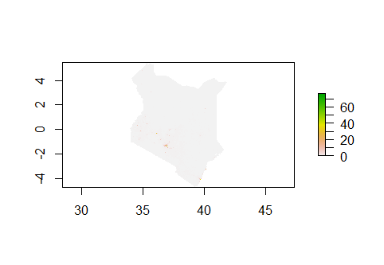
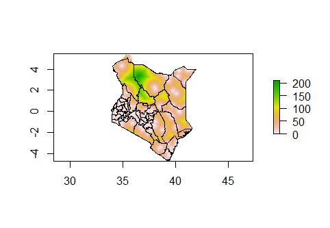
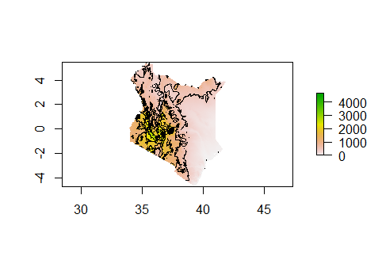

# Exercise 6 

#### For each of the following three steps you only need to download the administrative subdivisions, and their associated files not complete the entire exercise. Download the administrative subdivision for your selected country. Download GADM ADMs Download the population raster from Worldpop for your selected county following these instructions. Download population geospatial raster from Worldpop. Download the 12 rasters from your selected country and stack them following these instructions. Downloading geospatial rasters from Worldpop. Produce a raster stack and calculate summary statistics using the script posted to our slack channel

Map of Kenya:


Rasta Stack: 







Summary Output:
```
    sum.water   sum.dst011  sum.dst040 sum.dst130 sum.dst140 sum.dst150 sum.dst160
1   245354.69  -1133.94434  71769.2969   4504.381   52034.92  2584456.5  539194.69
2   109223.71   3912.13696   -897.9589  31036.812   93417.05  2247934.2  494289.78
3   182598.69    -15.44862  14662.1289  19228.459   31182.44  2051382.1  269311.16
4   103204.50   3410.19653    387.0758   8642.393   26985.04  1554647.6  317013.03
5   133118.52   4638.70996  -2018.2643  14844.472   37663.57  1328987.5  323373.50
6   250158.12   8286.37695  -5051.0581  25064.963   48677.61  1688293.1  450399.47
7  1406176.00  10766.17285  11583.9521  67163.555  193755.47  4157372.2 1530579.88
8   677185.19   -398.99536  81776.8438  39749.629   55975.86  5162748.5  741939.38
9   208328.72   3759.02808  -1287.1432  16404.221   95588.28  1403697.2  260730.22
10  192557.55    310.92734   1568.8932  15467.553   66709.80   925578.8  237204.62
11  532267.94 -15748.58887  53541.4336  78204.953   96635.29  4277515.5  683474.50
12  107901.15  29375.81836  94409.8047 159486.062   38658.14  3235140.2   80463.07
13  824093.50 -12635.50000  65883.8125 148554.906  173861.89  7708333.5 1095872.88
14  353537.03   1683.47229  33886.5469  44332.730  177880.72  5490896.0  469727.50
15  497501.03   2445.55127  32709.0840  44703.465  129448.06  5230309.5  424709.69
16  324106.91   3955.02100   5135.2021  33789.578  204399.56  3043257.2 1015211.94
17  378217.78    742.89185   4905.8101 158317.688  558031.62  4326290.5 1178680.75
18   90448.31  -2966.19116  14890.6689  10737.563  128327.95  2167553.0  612435.06
19  268755.62   3610.89917   -358.6650  90242.477  553098.50  3134990.2  913725.00
20   26144.52  -1916.89783   2744.0984   6560.277   56959.06   439727.5  143639.08
21  770336.12   1397.94751  37707.9531  29523.912  233118.22  7225103.0  874492.06
22  439535.16   9023.23926  25405.2754  27658.229  217109.27  7712159.5  491560.94
23  282876.78   2720.79272  21724.4238  21531.490   66104.89  2575232.2  592683.56
24 1290225.12     36.34054  28020.8066  22915.795  221526.98  3171260.0 1463862.38
25 3249171.00  -5892.41895  79901.0625 102452.195  319909.47  5032479.0 2864515.25
26  976942.88 -11334.89160 252192.5000 189535.266   21218.32  2398525.0 1099037.38
27 2891476.00 -10679.26660 165240.8281 163202.344  247917.20  4107035.5 2313171.75
28 1529751.75  -3948.27222 181988.4219 103722.594   38056.78  1655616.9 1179098.12
29 1710887.12 -10658.64844 121407.6484  46167.012  137037.66  4963564.5 1840207.50
30 3080338.25   -668.51324 158673.5625  53233.910  292616.25  4787796.0 3268756.25
31  162841.14 -41214.17578  42090.8984 204654.672  283740.19   371624.9   93050.77
32  110695.06 -21314.80273  21982.6797 151049.781  180342.00   269883.0  111420.58
33  167700.78 -15192.13281  16054.0762 193125.719  278086.56   344778.2   37992.85
34   74754.05  -6172.67090   6648.3584  95541.562  142819.12   184802.5   50288.37
35   85595.48 -14442.20703  14915.5488 105544.648  148080.38   190179.5   40642.23
36   69371.10 -13426.76758  14061.2344  83472.258  120100.45   177158.4  117228.84
37   55713.44 -18637.50195  19338.0488  78500.500  141177.28   194340.9  103541.37
38   32840.23 -29040.12500  30010.2363  55405.078  136382.12   218022.3  248624.00
   sum.dst190 sum.dst200  sum.topo sum.slope   sum.ntl sum.pop19 mean.water   mean.dst011
1   164318.56  438437.41  33382208  35586.19  883.1774  22127.58  12.065008 -0.0557602867
2   228894.30  167160.42  37076440 302184.91  731.9148  33016.66   5.230339  0.1873384714
3    99720.32  159486.84  26389114 153105.94  618.9888  20568.57   9.867169 -0.0008348040
4    79279.13  110808.21  22922146 159526.80 1638.6157  41097.00   7.537007  0.2490460724
5   136210.89   67333.15  18189416 139204.86  510.1288  17979.96  11.955847  0.4166190326
6   270742.81  123269.80  21563680 165728.53  359.5101  11333.26  19.039862  0.6306869984
7  2281303.50  748079.75  77512224 458879.81  707.5936  16434.62  24.609709  0.1884205043
8  1010190.38  489239.06  63502848 264470.28  829.2312  35010.58  12.390189 -0.0073002600
9   222797.06  182937.41  27668478 198401.11  258.6615  29040.10  14.060898  0.2537111044
10  240176.27  105770.05  20367836 139615.75  315.2516  30378.78  18.079950  0.0291941352
11 1575893.75  371584.16  65011536 394352.59  478.1037  23219.68   9.896276 -0.2928081453
12  583932.00  139490.86  36778548  38527.94  505.7771  26548.56   2.880378  0.7841756940
13 1264585.62  328591.75  95704192 420155.22 1688.4045  40972.07  11.268740 -0.1727791280
14  744509.00  408253.72  77575656 455093.22 1088.5688  31627.86   7.098867  0.0338033773
15 1018731.12  207817.05  72873112 332592.03  824.3044  15863.75   8.271904  0.0406619571
16  293316.03  727688.31  55776096 195976.00 1189.1855  18633.98  12.417616  0.1515300423
17  350968.88  671489.81  77822680 310126.06 1013.4481  43947.55  11.587893  0.0227608308
18  142306.23  221791.12  30520400 102764.21  792.6765  27408.11   5.472803 -0.1794768572
19  305049.19  878336.94  68112352 203170.89 1848.2493  26923.21   9.912149  0.1331759095
20   11359.39   79658.58   7723167  20262.50  903.5555  23648.56   7.323170 -0.5369296670
21 1283931.75  390634.16  80345944 306502.25 1217.1320  22874.33  13.463968  0.0244333874
22 1143590.62  600147.00  88569984 386705.03 1324.7177  23253.41   7.410256  0.1521255225
23  307005.00  155178.47  33990800 195616.89  553.6178  17050.22  15.008026  0.1443516463
24 2465927.00  439388.81  80953576 343587.09  448.7158  33392.52  25.007534  0.0007043633
25 5530775.00 1427673.50  93530976 348343.50  906.9326  30495.33  38.083736 -0.0690654069
26 2375017.25  126454.84  43929644 122713.56  694.7044  19566.40  20.969780 -0.2432999760
27 5314688.50  501171.22  92888064 605907.38  508.1136  22239.67  34.094986 -0.1259251237
28 3510632.25   79643.80  45307192 133588.39  124.7400  28573.65  30.038092 -0.0775279775
29 3902697.75  479704.81 101234392 409422.84  756.0024  27546.96  19.512400 -0.1215602160
30 8659713.00 1157840.62 127651520 906232.31  800.4100  32246.51  27.743889 -0.0060211429
31   87024.07  682178.81  14070211  45270.54  389.5507  50280.74  22.780447 -5.7656025887
32   53330.31  547180.69  10768970  21599.82  343.7699  25052.96  19.497395 -3.7543060780
33   88764.74  709052.56  15110462  61661.79  348.5152  38302.21  23.067902 -2.0897376537
34   22255.39  433740.44   8699351  29856.07  588.1578  31479.46  17.458836 -1.4416294098
35   34692.74  404751.28   8247318  29174.93  232.3827  27147.69  20.968876 -3.5380003452
36   97606.23  526732.19  12181242  50884.91  241.3878  28688.03  11.961805 -2.3152058125
37   58013.47  573692.06  12388529  48358.25  332.8021  33810.04   9.452839 -3.1622047424
38  128757.50  902665.50  15610447  24185.34  424.0411  34464.57   3.916552 -3.4633474350
   mean.dst040 mean.dst130 mean.dst140 mean.dst150 mean.dst160 mean.dst190 mean.dst200
1   3.52916479   0.2214973   2.5587518   127.08739   26.514221    8.080158   21.559608
2  -0.04300009   1.4862437   4.4734135   107.64566   23.669798   10.960942    8.004725
3   0.79230416   1.0390570   1.6850200   110.85148   14.552891    5.388633    8.618263
4   0.02826808   0.6311525   1.9707127   113.53565   23.151407    5.789742    8.092304
5  -0.18126749   1.3332348   3.3826988   119.36109   29.043324   12.233584    6.047430
6  -0.38444263   1.9077271   3.7049165   128.49820   34.280491   20.606588    9.382225
7   0.20273258   1.1754401   3.3909452    72.75883   26.786921   39.925453   13.092262
8   1.49623847   0.7272832   1.0241681    94.46076   13.574970   18.483053    8.951413
9  -0.08687419   1.1071832   6.4516168    94.74087   17.597673   15.037421   12.347141
10  0.14730927   1.4523065   6.2636337    86.90607   22.272032   22.551050    9.931147
11  0.99547762   1.4540380   1.7967070    79.53039   12.707608   29.300055    6.908738
12  2.52023196   4.2574162   1.0319636    86.36077    2.147929   15.587831    3.723653
13  0.90090209   2.0313551   2.3774054   105.40455   14.985079   17.292074    4.493197
14  0.68042684   0.8901816   3.5717661   110.25476    9.431920   14.949411    8.197554
15  0.54385096   0.7432804   2.1523211    86.96387    7.061609   16.938349    3.455355
16  0.19674671   1.2945914   7.8312287   116.59733   38.896152   11.237915   27.880165
17  0.15030494   4.8505611  17.0970573   132.54953   36.112598   10.753036   20.573206
18  0.90099734   0.6497033   7.7648048   131.15324   37.056923    8.610597   13.420030
19 -0.01322815   3.3282909  20.3991833   115.62360   33.699680   11.250716   32.394512
20  0.76863134   1.8375560  15.9544287   123.16919   40.233799    3.181804   22.312641
21  0.65906125   0.5160202   4.0744505   126.28067   15.284410   22.440615    6.827521
22  0.42831522   0.4662985   3.6603107   130.02164    8.287374   19.280140   10.118060
23  1.15258920   1.1423531   3.5071945   136.62894   31.444822   16.288149    8.232993
24  0.54310775   0.4441609   4.2937031    61.46632   28.373024   47.795345    8.516367
25  0.93652534   1.2008486   3.7496789    58.98600   33.575161   64.826561   16.733850
26  5.41323471   4.0683165   0.4554448    51.48360   23.590500   50.979019    2.714314
27  1.94844568   1.9244088   2.9233284    48.42832   27.275883   62.668423    5.909586
28  3.57351112   2.0366890   0.7472801    32.50957   23.152683   68.934509    1.563880
29  1.38463521   0.5265275   1.5628930    56.60868   20.987278   44.509655    5.470958
30  1.42913580   0.4794654   2.6355264    43.12256   29.440926   77.996017   10.428401
31  5.88825083  28.6298962  39.6934586    51.98798   13.017216   12.174118   95.432503
32  3.87194324  26.6053181  31.7647343    47.53614   19.625185    9.393392   96.378265
33  2.20830131  26.5652008  38.2518997    47.42559    5.226066   12.209939   97.532967
34  1.55272639  22.3137665  33.3554573    43.16069   11.744865    5.197754  101.300232
35  3.65395784  25.8559513  36.2762032    46.58949    9.956388    8.498904   99.154526
36  2.42460847  14.3932981  20.7091751    30.54779   20.214018   16.830448   90.825546
37  3.28106570  13.3190947  23.9533958    32.97362   17.567751    9.843083   97.337708
38  3.57904363   6.6076522  16.2650356    26.00151   29.651089   15.355718  107.652580
   mean.topo mean.slope    mean.ntl mean.pop19
1  1641.5281   1.749906 0.043429140   4.726185
2  1775.4602  14.470572 0.035048824   7.129489
3  1426.0006   8.273456 0.033448584   4.782480
4  1674.0004  11.650214 0.119667821  12.241470
5  1633.6561  12.502483 0.045816477   7.681142
6  1641.2399  12.613815 0.027362784   4.667087
7  1356.5537   8.030929 0.012383709   4.297744
8  1161.8865   4.838908 0.015172115   4.548204
9  1867.4508  13.390845 0.017458051   8.325697
10 1912.4126  13.109047 0.029600160   7.400517
11 1208.7373   7.332063 0.008889219   5.017809
12  981.7886   1.028488 0.013501517   6.770971
13 1308.6691   5.745246 0.023087418   4.629306
14 1557.6848   9.138070 0.021857981   5.047466
15 1211.6545   5.529977 0.013705634  10.372047
16 2136.9683   7.508494 0.045561664   4.916423
17 2384.3430   9.501689 0.031050174   6.436168
18 1846.7135   6.218007 0.047962885   5.886347
19 2512.0957   7.493277 0.068166472   8.544806
20 2163.2856   5.675596 0.253089011  14.875390
21 1404.2899   5.357060 0.021273086   4.122601
22 1493.2281   6.519577 0.022333816   4.407524
23 1803.3817  10.378453 0.029372189   4.380351
24 1569.0668   6.659509 0.008697145  20.181091
25 1096.2823   4.082956 0.010630214  11.314027
26  942.9363   2.634009 0.014911617  21.208849
27 1095.2943   7.144588 0.005991447  13.260007
28  889.6486   2.623132 0.002449386  87.138557
29 1154.5624   4.669404 0.008622088  21.382891
30 1149.7274   8.162223 0.007209106  25.940067
31 1968.3336   6.333063 0.054495677  12.865710
32 1896.8042   3.804507 0.060550280   7.344075
33 2078.5034   8.481822 0.047939640  11.881633
34 2031.7365   6.972895 0.137364462  11.569468
35 2020.3986   7.147171 0.056928288  12.279768
36 2100.4373   8.774192 0.041623000   7.935616
37 2101.9482   8.204892 0.056466170   8.739712
38 1861.7139   2.884362 0.050571464   6.424453
```
