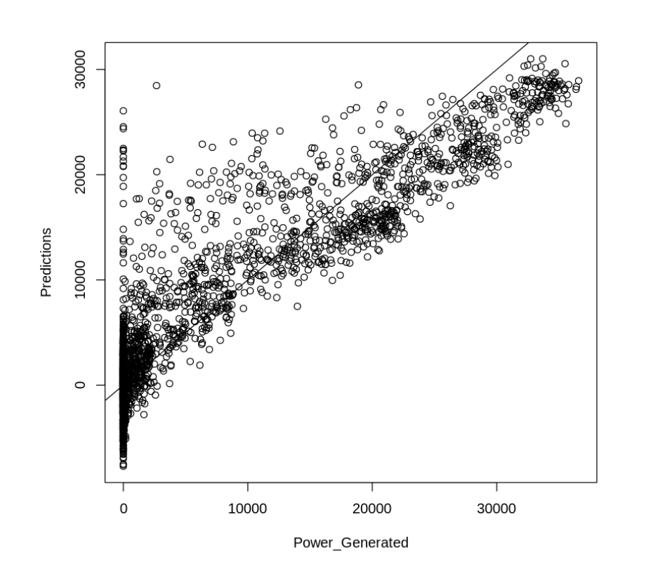

#### Problem Statement that introduces your selected topic, identifies significant goals associated with the implementation of your applied machine learning method, demonstrates why your problem is important, and describes and analyzes the complex nature of your problem including any process oriented causes and effects. Conclude your problem statement with a stated central research question. You are welcome to articulate a central research question in broad and general terms, given the abbreviated time frame for this investigation.

Research Question: Can weather be used to predict the power generated from solar panels?

Renewable energy, especially solar, has huge variances in their power output day to day. This poses a problem for energy suppliers as they must be able to provide a consistent source of electricity to the grid to meet energy demand. The large variability in solar output can cause inefficiency as energy suppliers as they may ramp up production in coal or natural gas power plants to ensure there is enough capacity to meet fluctations in demand. However, if they can accurately predict output from solar panels the excess capacity to ensure energy demand is met decreases which in-turn decrease costs and green house gas emissions.

The primary factor in energy output of solar panels is the weather. Additionally, the relationship between different weather variables and the energy output are likely non-linear. For example, one of the features in my dataset, distance to solar noon, measures how far the earth has to rotate in radians before its at solar noon, the point where the sun is highest in the sky. Since this feature changes in a non-linear fashion it is likely that it will affect power generation in a non-linear manner. Because of this an OLS regression is unlikely to provide satisfactory results. Thus, I hope to use a nueral network to overcome the problem posed by these non-linear aspects of the data and accurately predict power generated.  

#### A description of the data that you are using as input for your applied machine learning methodology, including the source of the data, the different features (variables) and well as their data class (i.e. continuous or discrete). Be sure to include a description of your dataset size (number of rows / observations as well as number of columns / variables / features) and provide context on how the data was collected as well as the source organization, as it is relevant to your investigation.

[Solar Panel Power Generation Data](https://www.kaggle.com/vipulgote4/solar-power-generation)

This data was compiled by Ph.D. candidate Alexandra Constantin and records the weather and the power output from a solar panel system in Berkley California from 2008 to 2009. There are 2920 observations with 16 variables: Day of year (discrete), year (discrete), month (discrete), day (discrete), first hour of period (discrete), is daylight (discrete), distance to solar noon measured in radians (continuous), average temperature for the day (continuous), average wind direction for the day (discrete), average wind speed for the day measured in miles per hour (continuous), sky cover (discrete), visibility (discrete), relative humidity (discrete), average wind speed for the period in miles per hour (continuous), average Barometric Pressurefor the period (continuous), and power generated measured in joules (continuous).

#### Provide the specification for your applied machine learning method that presented the most promise in providing a solution to your problem. Include the section from your python or R script that specifies your model architecture, layers, functional arguments and specifications for compiling and fitting. Provide a brief description of how you implemented your code in practice.

I initially compared an OLS Regression to a single layer neural network.

Code in R:
```
m <- lm(Power.Generated ~ Day.of.Year + as.factor(Month) + as.factor(First.Hour.of.Period)+ Is.Daylight +Sky.Cover +  
       Relative.Humidity  + Average.Wind.Direction..Day. + Average.Temperature..Day. +
        Average.Wind.Speed..Day. + Visibility  + Average.Barometric.Pressure..Period. + Distance.to.Solar.Noon, data= df)

```
Test Statistics for Linear Regression


The Linear Regression performed pretty well wit an R-squared around 80% and an MSE of 18,533,025



Its predictions also seem relatively accurate.

I then compared the OLS regression to a neural network with a single layer and the 6 continuous variables in the model.
```
s = np.stack([x1, x4, x5, x9, x10, x11], axis=1)
ys = df['Power_Generated'].to_numpy(dtype='float')
xt = ss.fit_transform(xs)
model = tf.keras.Sequential([keras.layers.Dense(units=1, input_shape=[6])])
model.compile(optimizer='sgd', loss='mean_squared_error')
```

The neural network performed slightly worse than the OLS model with an MSE of 38,589,161.89939041.

Here are its predictions:


#### Conclude with a section that preliminarily assesses model performance. If you have results from your implementation, you are welcome to add those in this section. Compare your preliminary results with those from the literature on your topic for a comparative assessment. If you are not able to produce preliminary results, provide a cursory literature review that includes 2 sources that present and describes their validation. With more time and project support, estimate what an ideal outcome looks like in terms of model validation.

A preliminary assessment of the model puts a linear regression ahead of the nueral network. However, this is before including discrete variables in the nueral network and with only a single layer thus I think it is possible to imporve the nueral network to make it commpetitive with the OLS regression. I will also explore other models such as boosted trees to provide further benchmarks to compare my model results against. The literature does not provide a clear benchmark to compare my model with as they often use variations of the MSE which is dependent on the scale of the data, however, a cursory look at their outputs indicate that my model can be improved. I would ideally like to get my MSE below 5% of the range in power generation or about 1,800. 

Sources:
https://www.sciencedirect.com/science/article/abs/pii/S0038092X09001364
https://www-sciencedirect-com.proxy.wm.edu/science/article/abs/pii/S0038092X11003008
