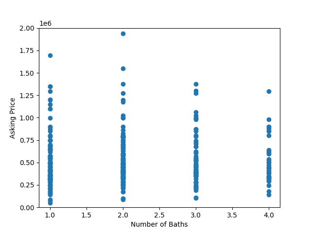
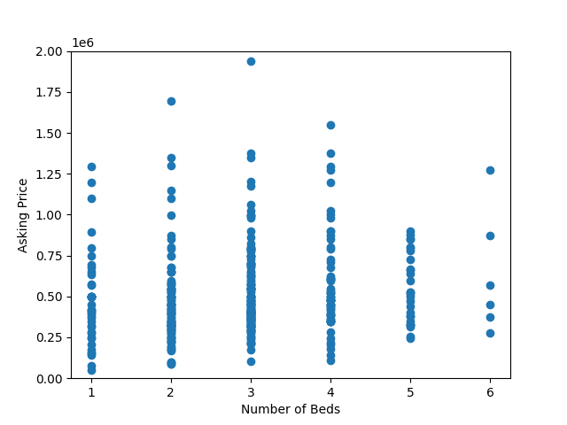
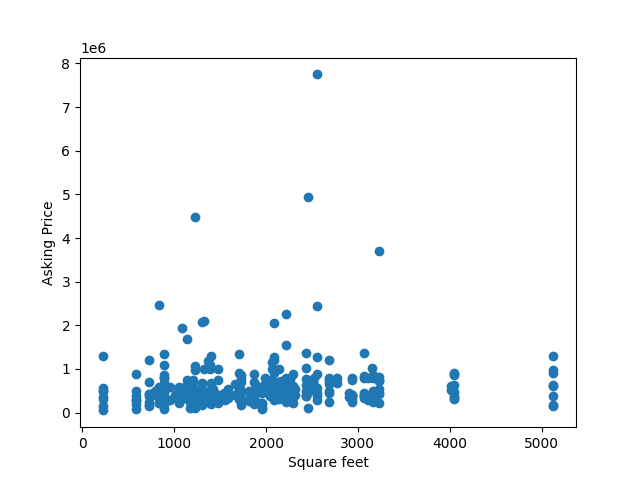
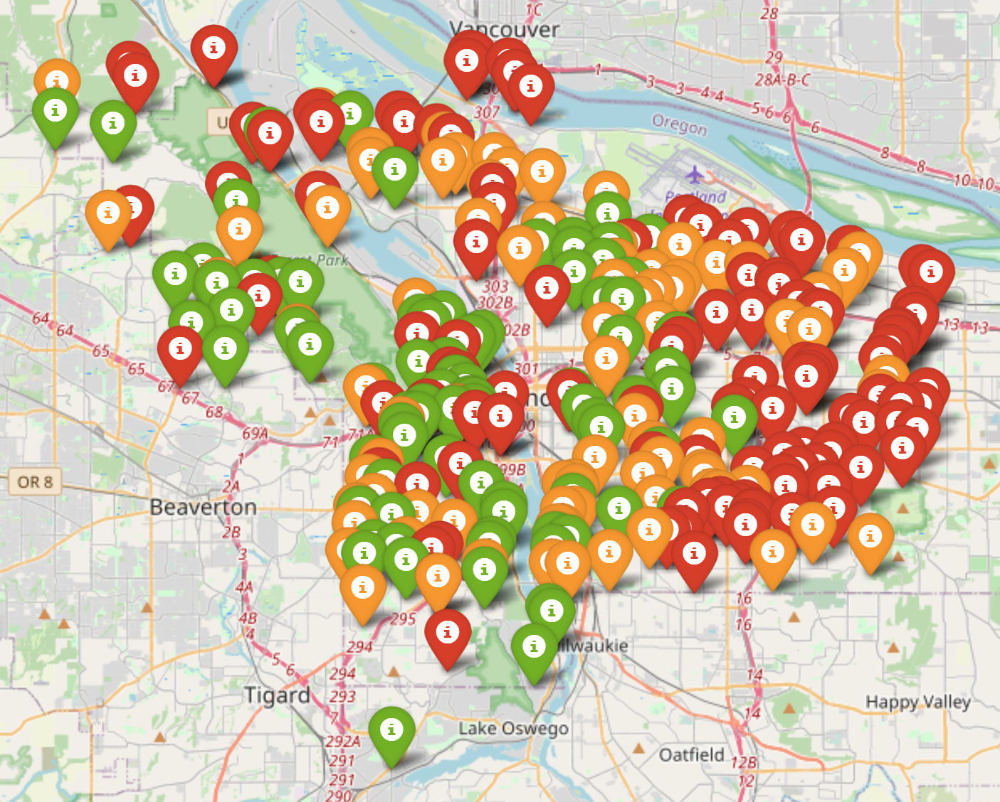
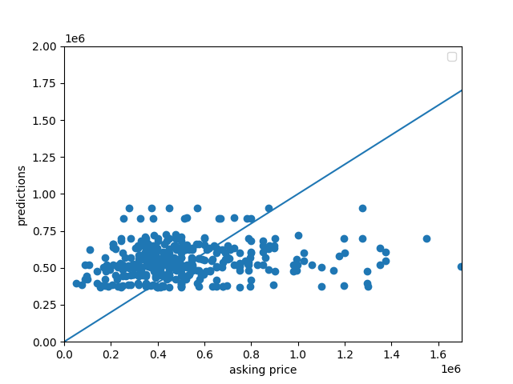
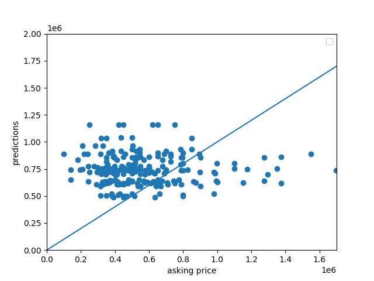

# Project 1: How Much for the City of Roses; Predicting the Price of Houses in Portland, Oregon

## Data:
My data consisted of 400 house listings in Portland, Oregon scrapped from Zillow on February 22nd, 2021. These listings included: price, number of bedrooms, number of bathrooms, and square footage. Prices for homes ranged from $50,000 to $7,750,000 with a median of $459,900. Square footage ranged from 220 square feet to 5129 square feet with a mean of 1773 square feet. The number of bedrooms ranged from 1 to 6 with a median of 3. Lastly, the number of baths ranged from 1 to 4 with a median of 2.

Below are several scatterplots comparing the different features to the listing price. From an initial glance there does not appear to be a clear relationship among any of them.

#### Baths vs. Price

#### Bedrooms vs. Price

#### Square Footage vs. Price

However, we do see geographic trends when we examine the data. Below is a map of Portland where green markers indicate houses worth $650,000 or more, orange markers indicate houses worth between $460,000 and $649,999, and red markers indicating houses worth $459,999 or less. From the map, we can see that generally houses of similar price are near each other and that there are more high priced homes in the western part of the city than the eastern part of the city.

## Model Architecture:
The model used to predict prices is a neural network that uses mean squared error to measure loss and optimizes using stochastic gradient descent to optimize the function. There is a single layer with three inputs, one for each feature. To run the model I standardized the data, dividing square footage by 1000 and price by 100,000 then fitted the model for 500 epochs. 

## Model Results:
Our model ended with a mean squared error of 362,024,156,889.3795. However, this does not tell us much about the model and would only be useful in comparing different models. To get a better understanding of the accuracy of the model I compared the predicted price to the listed price.

From this graph we can see that our model does not do a great job of predicting price especially when the listing prices are really low or really high. This most likely means there is some other feature about houses that is important to pricing that is not currently captured in our data.

## Application of Model for ranking Best and Worst Deals
Given how far off my model is from most predictions, especially those at the extreme, I'm hesitant to interpret the difference between predicted price and actual price as an indication of a "good deal." If I were to do so I would limit its application to houses priced towards the median as that's where the model seems to most accurately price homes. However, I likely would not do that as the model most likely lacks one or more important feature of house prices.

In an attempt to fix this problem I created a model that includes longitude and latitude as features. This approach lead to an MSE of 438,759,294,336.513 which was larger than my initial model. Additionally, the graph of the predicted price vs. the listed price is not much better than my initial model.

This indicates that in the future I should use a different approach to capture the effect of location on housing prices. I may try using clustering methods in the future to try and find underlying trends in housing prices based on location

Sources:

https://medium.com/datadream/mapping-with-folium-a-tale-of-3-cities-8e5ab7f4e53d

https://towardsdatascience.com/pythons-geocoding-convert-a-list-of-addresses-into-a-map-f522ef513fd6

Python File:
