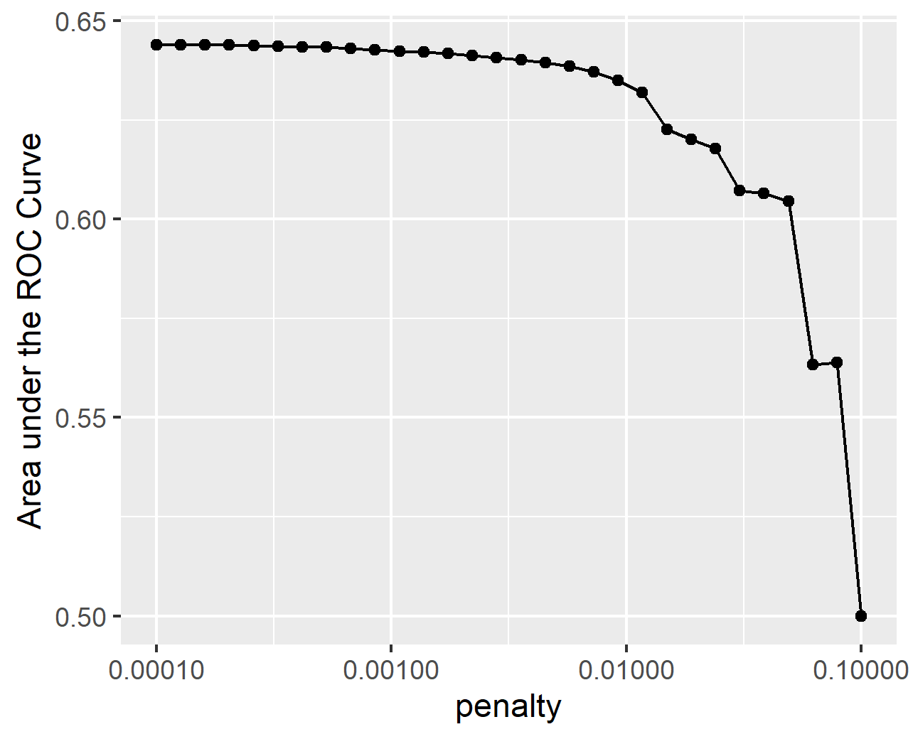
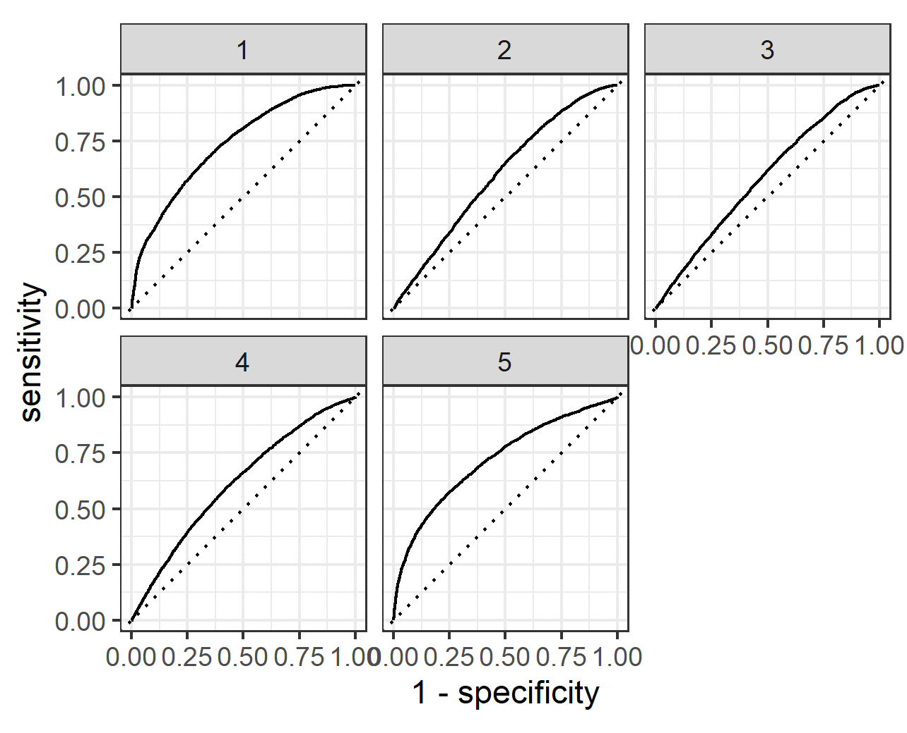
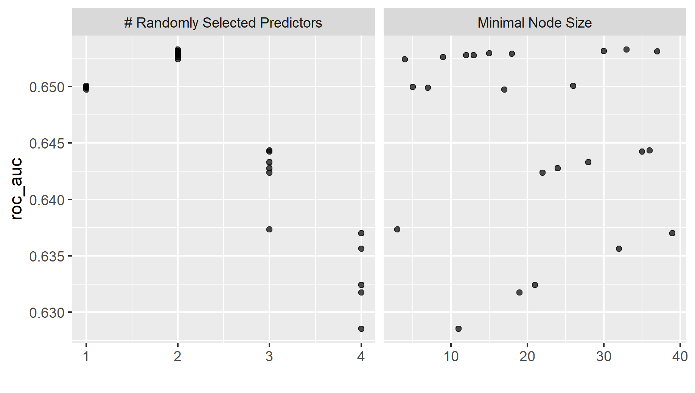
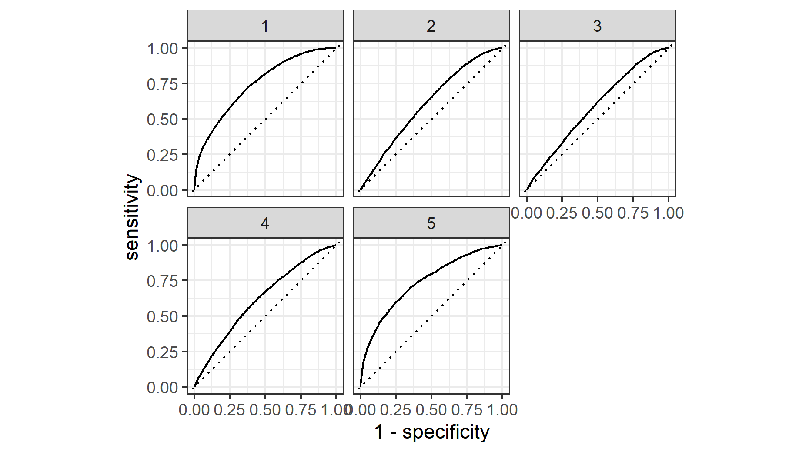
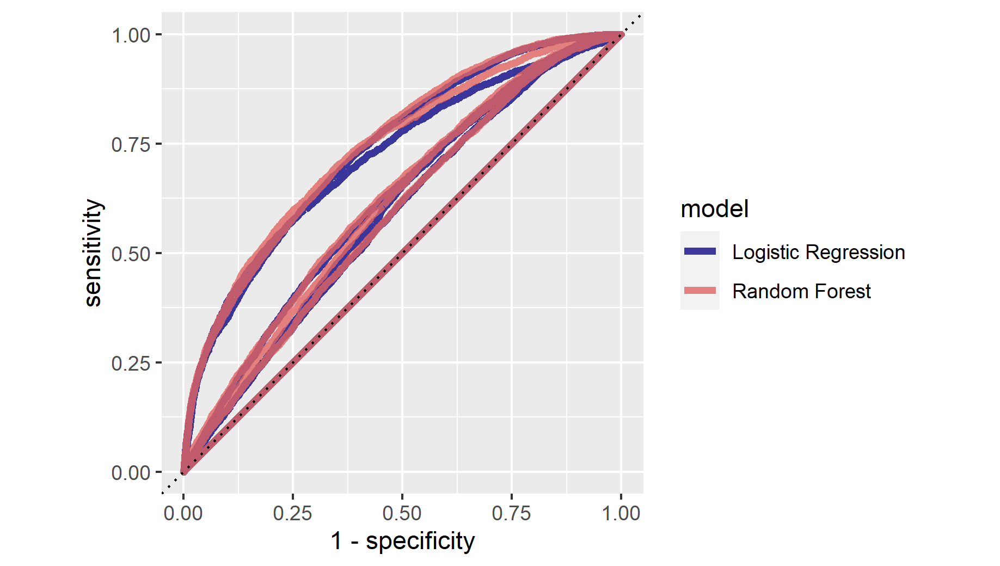
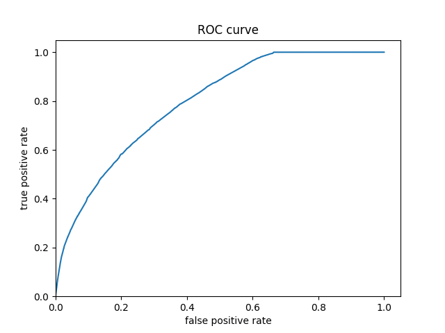
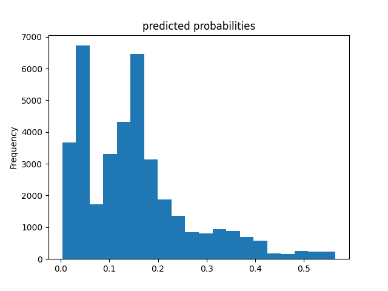
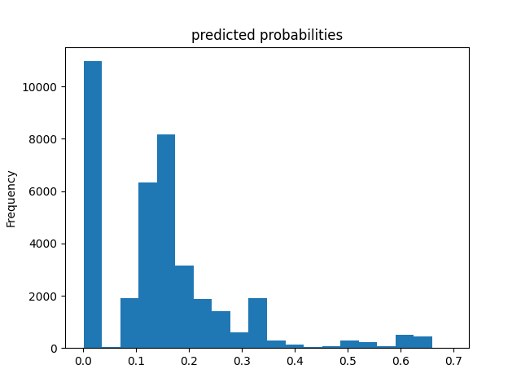

# Project 2: Predicting Wealth Outcomes in 2014 Kenya

#### Question 1: Using the R script provided, split and sample your DHS persons data and evaluate the AUC - ROC values you produce

#### Which "top_model" performed the best (had the largest AUC)?
```
    penalty .metric .estimator  mean     n std_err .config              
      <dbl> <chr>   <chr>      <dbl> <int>   <dbl> <chr>                
 1 0.0001   roc_auc hand_till  0.644     1      NA Preprocessor1_Model01
 2 0.000127 roc_auc hand_till  0.644     1      NA Preprocessor1_Model02
 3 0.000161 roc_auc hand_till  0.644     1      NA Preprocessor1_Model03
 4 0.000204 roc_auc hand_till  0.644     1      NA Preprocessor1_Model04
 5 0.000259 roc_auc hand_till  0.644     1      NA Preprocessor1_Model05
 6 0.000329 roc_auc hand_till  0.644     1      NA Preprocessor1_Model06
 7 0.000418 roc_auc hand_till  0.643     1      NA Preprocessor1_Model07
 8 0.000530 roc_auc hand_till  0.643     1      NA Preprocessor1_Model08
 9 0.000672 roc_auc hand_till  0.643     1      NA Preprocessor1_Model09
10 0.000853 roc_auc hand_till  0.643     1      NA Preprocessor1_Model10
11 0.00108  roc_auc hand_till  0.642     1      NA Preprocessor1_Model11
12 0.00137  roc_auc hand_till  0.642     1      NA Preprocessor1_Model12
13 0.00174  roc_auc hand_till  0.642     1      NA Preprocessor1_Model13
14 0.00221  roc_auc hand_till  0.641     1      NA Preprocessor1_Model14
15 0.00281  roc_auc hand_till  0.641     1      NA Preprocessor1_Model15
```



From the plot, it seems that the first 10 models all perform at around the same level. This is confirmed by the table which shows that the first 6 models have the same roc auc: 0.644. 


#### Are you able to use the feature selection penalty to tune your hyperparameter and remove any potentially irrelevant predictors? Provide justification for your selected penalty value? 

Yes, I chose model 6 with a penalty of 0.000329. This is the model with the highest penalty that does not cause a dip in the performance of the model. Thus, hopefull filtering irrelevant predictors without decreasing the usefulness of the model. 

#### Finally, provide your ROC plots and interpret them. How effective is your penalized logistic regression model at predicting each of the five wealth outcomes.



My penalized regression model is great at predicting the first and fifth wealth outcomes. For the second and fourth wealth outcomes it is good. It does the worst at predicting the third wealth outcome, though even here it stays above the 45 degree line.  


#### Question 2: Using the R script provided, set up your random forest model and produce the AUC - ROC values for the randomly selected predictors, and the minimal node size, again with wealth as the target.
```
   mtry min_n .metric .estimator  mean     n std_err .config              
  <int> <int> <chr>   <chr>      <dbl> <int>   <dbl> <chr>                
1     2    33 roc_auc hand_till  0.653     1      NA Preprocessor1_Model07
2     2    30 roc_auc hand_till  0.653     1      NA Preprocessor1_Model20
3     2    37 roc_auc hand_till  0.653     1      NA Preprocessor1_Model02
4     2    15 roc_auc hand_till  0.653     1      NA Preprocessor1_Model05
5     2    18 roc_auc hand_till  0.653     1      NA Preprocessor1_Model11
```




Above is a table of the different random forest models and a plot of the minimal node size compared to random predictors. 

#### How did your random forest model fare when compared to the penalized logistic regression?
My random forest model performed better than the penalized logistic regression. the roc auc of the best random forest model is 0.653 compared to 0.644 for the best logistic regression

#### Provide your ROC plots and interpret them.


The random forest model performance mirrors that of the penalized logistic regression. It performs excellently when predicting wealth outcomes one and and five. It still performs well for outcomes two and four. It does the worst for outcome three though it remains above the 45 degree line.

#### Are you able to provide a plot that supports the relative importance of each feature's contribution towards the predictive power of your random forest ensemble model?


#### Question 3: Using the python script provided, train a logistic regression model using the tensorflow estimator API and your DHS data, again with wealth as the target. Apply the linear classifier to the feature columns and determine the accuracy, AUC and other evaluative metrics towards each of the different wealth outcomes 

```
accuracy                  0.858040
accuracy_baseline         0.855590
auc                       0.774327
auc_precision_recall      0.370888
average_loss              0.348833
label/mean                0.144410
loss                      0.348833
precision                 0.598740
prediction/mean           0.151630
recall                    0.051453
global_step             100.000000
```
Above is an evaluation of the logistic regression. 

#### Then continue with your linear classifier adding the derived feature columns you have selected in order to extend capturing combinations of correlations (instead of learning on single model weights for each outcome). Again produce your ROC curves and interpret the results.





The ROC curve shows that the model has predictive power. Additionally, the evaluation table shows that it has an accuracy of 0.85 and an AUC 0.77 which is better than the previous models. However, the histogram of predicted probabilities shows that the models predictions are clustered to the left which seems like it may be cause for concern.

#### Question 4: Using the python script provided, train a gradient boosting model using decision trees with the tensorflow estimator. Provide evaluative metrics including a measure of accuracy and AUC.

```
accuracy                  0.863568
accuracy_baseline         0.855590
auc                       0.792228
auc_precision_recall      0.400613
average_loss              0.329328
label/mean                0.144410
loss                      0.329328
precision                 0.601324
prediction/mean           0.144217
recall                    0.163929
global_step             100.000000
```

#### Produce the predicted probabilities plot as well as the ROC curve for each wealth outcome and interpret these results.




The gradient boosted trees performed slightly better than the logistic regression. There ROC curves and predicted probabilities histogram are very similar, though gradient boosted trees seemed to have more predictions clustered at 0. Thus, the interpretation for logistic regression applies to the gradient boosted trees model and is thus the most accurate model so far.

#### Question 5: Analyze all four models. According to the evaluation metrics, which model produced the best results? Were there any discrepancies among the five wealth outcomes from your DHS survey dataset?

According to the evaluation metrics the boosted trees model produced the best results with AUC of 0.79 with the logistic regression close behind it at 0.77. These both significantly outpreformed the penalized logistic and the random forest models. There are notable discrepancies among the five wealth outcomes from the DHS survey of Kenya in 2014. In their report, the DHS reported that "Three-quarters of urban residents (75 percent) are in the two highest wealth
quintiles, while more than three-quarters of rural residents (78 percent) are in the lowest three quintiles
(and are nearly equally distributed across these quintiles)." Additionally, they note that there are geographic discrepancies as well saying "Nine in 10 people in Nairobi are in the two highest wealth quintiles, and 7 in 10 people in North Eastern are in the lowest wealth quintile." Thus, a geographic componet would likely make these models more accurate. 

Source: https://dhsprogram.com/publications/publication-fr308-dhs-final-reports.cfm (page 17 of the report) 
