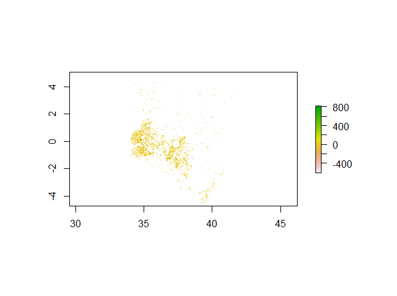

# Project 3:  Applying Geospatial Covariates to Predicting Populations in Kenya

## Data
My data consists of geospatial data organized into 13 rasters. These 13 rasters include things such as topography, waterways, elevation, and of course the target for my model: population. For this project I focused on Kenya and collected the relevant data from WorldPop. I used data from The Demographic and Health Surveys (DHS) Program to determine the administrative boundries for Kenya and map the data from WorldPop.

Below is a map of Kenya for reference:

## Linear Regression:
The first model that I use is an OLS linear regression which attempts to predict population values at 100 x 100 meter resolution in Kenya. This model predicted that the population of Kenya, based off of geospatioal covariates, was 55,198,785. The actual population was 55,188,525 which puts the model at a slight overestimate. However, this simple comparison masks under and over predictions in individual administrative zones. Thus, I examine the absolute value of the difference in the predicted and actual populations of counties in Kenya. The sum of these differences is 39,540,587 which has little value on its own but is useful when used in comparison to other models. 

Plot of the population sums:

Plot of the difference in sums:

## Random Forest:
The second model that I use is a random forest with 500 trees and which tries 4 variables at each split to predict population values at 100 x 100 meter resolution in Kenya.This model predicted that the population of Kenya, based off of geospatial covariates, was 55,191,482 compared to the actual population of 55,188,525. This estimate is closer than the estimate provided by the linear regression. Additionally, the sum of the absolute value of the differences is smaller too as it is only 27,016,105. Thus, it seems that the random forest model performs better.

Plot of the model:

Plot of the node purity:

Plot of the population sums:

Plot of the difference in sums:

## Discussion
While both models were fairly accurate, the random forest model edged out the linear regression model. Additionally, both models seemed to perform about the same in each geographic area. Both models had an especially difficult time predicting population towards the south and southeast of the country. This could be due to a number of factors as there is a lot of spatial variation throughout Kenya. These areas of the country have a tropical climate and even contain rainforests which differs from the rest of the country which tends to be either arid or temperate. However, at the same time these areas are also the most densly populated likely due to their proximity to fresh water (i.e. Lake Victoria). Thus, we see a high variation in population in an area whose geospatial covariates aren't represented anywhere else in the sample which most likely lead to the difficulty both models had in predicting population. 

Source: https://en.wikipedia.org/wiki/Geography_of_Kenya
