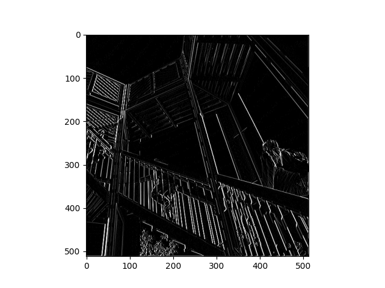
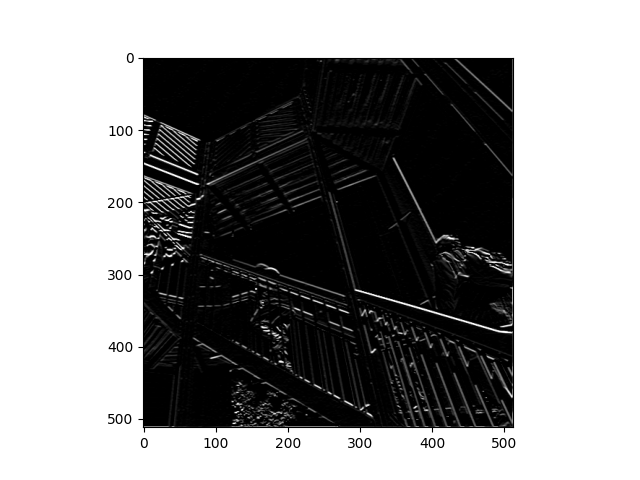
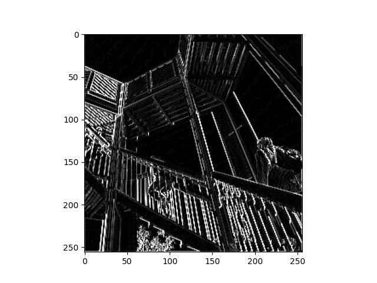

#### Question 1: Modify the existing filter and if needed the associated weight in order to apply your new filters to the image 3 times. Plot each result, upload them to your response, and describe how each filter transformed the existing image as it convolved through the original array and reduced the object size.

Filter 1: 
filter = [ [-5, 0, -5], [5, 0, 5], [-5, 0, 5]]

This filter seemed to emphasize edges. Both vertical and horizontal lines seem to pop. Additionally, the outlines of the people walking up the stairs are very prominent unlike the filter in the Maroney video.

Filter 2: 
filter = [ [1, 0, -1], [1, 0, -1], [1, 0, -1]

This filter emphasizes diagonal lines, however, it does so inconsistently. In the top left corner the diagonal supports for the railing are very prominent while only part of the rail in the center of the image is visible. Additionally, the supports in the top center of the picture, which are also placed diagonally in the opposite direction, are not visible. Thus, the filter probably only emphasizes diagonal lines going from top left to bottom right. 

Filter 3: 
filter = [ [0, 5, 0], [0, -5, 0], [0, 0, 0]]

This filter emphasizes vertical lines like the one used by Maroney. However, the contrast between the vertical lines and the rest of the picture are more dramatic. 

#### Question 2: What are you functionally accomplishing as you apply the filter to your original array (see the following snippet for reference)? Why is the application of a convolving filter to an image useful for computer vision? 

By applying a filter we either increase or decrease the brightness of certain pixels in the photo. This has the effect of highlighting or hiding different features of the photo depending on the filter used. For computer vision, this seems to have the same effect as dimensionality reduction in other types of statistical analysis: there are features of a photo that we know will not be relevant for certain applications and thus those features are essentially "noise" that might interfere with computer vision. Thus, by eliminating them and highlighting the relevant features we are able to better identify whatever object we are looking to identify.

#### Stretch goal: instead of using the misc.ascent() image from scipy, can you apply three filters and weights to your own selected image? Again describe the results

#### Question 4: Another useful method is pooling. Apply a 2x2 filter to one of your convolved images, and plot the result. 

I applied filter 3 and used a 2x2 filter to pool the image.

#### Question 5: In effect what have you accomplished by applying this filter? Does there seem to be a logic (i.e. maximizing, averaging or minimizing values?) associated with the pooling filter provided in the example exercise (convolutions & pooling)? Did the resulting image increase in size or decrease? Why would this method be useful? 

By applying this filter we reduced the size of the image by only including every other pixel. The only logic to it is that we alternate between each pixel though we could alter the purpose to maximize, average, or minimize values. The size of the image decreased which has a few advantages such as increasing the speed for any computer vision program to process the image and, like convolutions, potentially reducing noise. 

#### Stretch goal: again, instead of using misc.ascent(), apply the pooling filter to one of your transformed images.

