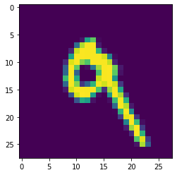

## Exercise 2
1. In the video, First steps in computer vision, Laurence Maroney introduces us to the Fashion MNIST data set and using it to train a neural network in order to teach a computer “how to see.” One of the first steps towards this goal is splitting the data into two groups, a set of training images and training labels and then also a set of test images and test labels. Why is this done? What is the purpose of splitting the data into a training set and a test set?

⋅⋅⋅We use the training data to create the model and the testing data to see how the model performs on data it has never seen before. If we were to use the entire dataset to train and then test the model, we would not have a good idea how the model would perform on new data as the model already knows the answer to the data we used to test it since it was used to teach the model.

2. The fashion MNIST example has increased the number of layers in our neural network from 1 in the past example, now to 3. The last two are .Dense layers that have activation arguments using the relu and softmax functions. What is the purpose of each of these functions. Also, why are there 10 neurons in the third and last layer in the neural network.

⋅⋅⋅ #### The relu function sets the outputs of neurons less than zero to zero in order to prevent it from skewing our model. The softmax function takes the class that has the highest probability of being a given image and sets the model prediction for that class to 1 and zero for the rest. This makes it easier to find the correct class. The reason that there are 10 neurons in the last layer is because there are 10 different classes of clothing that we are trying to predict using the data. Each neuron calculates the probability that a given image is a particular class.  


3. In the past example we used the optimizer and loss function, while in this one we are using the function adam in the optimizer argument and sparse_categorical- crossentropy for the loss argument. How do the optimizer and loss functions operate to produce model parameters (estimates) within the model.compile() function?

⋅⋅⋅Loss functions tell us how far off our predictions are from the actual value and our optimizer attempts to minimize this loss by changing the model parameters. That’s why we have to use a different loss function and optimizer for a classification problem then when we estimated house prices. 

4. Using the mnist drawings dataset (the dataset with the hand written numbers with corresponding labels) answer the following questions.
o	What is the shape of the images training set (how many and the dimension of each)?

⋅⋅⋅#### The training set has 60,000 images and each image is comprised of 784 pixels in a 28x28 format

o	What is the length of the labels training set?

... #### There are 60,000 labels in the training set.

o	What is the shape of the images test set?

... #### The test set has 10,000 images and each image is also comprised of 784 pixels in a 28x28 format. 

o	Estimate a probability model and apply it to the test set in order to produce the array of probabilities that a randomly selected image is each of the possible numeric outcomes (look towards the end of the basic image classification exercises for how to do this — you can apply the same method applied to the Fashion MNIST dataset but now apply it to the hand written letters MNIST dataset).

```

#import neccesary packages
import tensorflow as tf
import numpy as np
from tensorflow import keras

#import and load the data
mnist = tf.keras.datasets.mnist
(x_train, y_train),(x_test, y_test) = mnist.load_data()

#standardize the data
training_images  = x_train / 255.0
test_images = x_test / 255.0

#create the model
model = tf.keras.models.Sequential([tf.keras.layers.Flatten(), 
                                    tf.keras.layers.Dense(128, activation=tf.nn.relu), 
                                    tf.keras.layers.Dense(10, activation=tf.nn.softmax)]
#compile the model and fit the model
model.compile(optimizer = tf.keras.optimizers.Adam(),
              loss = 'sparse_categorical_crossentropy',
              metrics=['accuracy'])

model.fit(training_images, y_train, epochs=5)
predictions = model.predict(x_test)

#evaluate the model
model.evaluate(x_test, y_test)

```

5.	Use np.argmax() with your predictions object to return the numeral with the highest probability from the test labels dataset.
```
predictions = model.predict(x_test)
np.argmax(predictions)
```
6.	Produce a plot of your selected image and the accompanying histogram that illustrates the probability of that image being the selected number




```
histogram = plt.hist(predictions[7], bins='auto')  # arguments are passed to np.histogram
plt.title("Probabilities for prediction 8")
```


